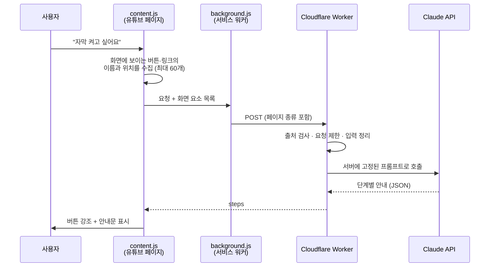

# 유튜브 AI 도우미 (YouTube AI Helper)

> "이 버튼이 뭔지 모르겠다"는 부모님을 위해, AI가 유튜브 화면에서 **지금 눌러야 할 버튼을 직접 가리켜 주는** 크롬 확장 프로그램입니다.

유튜브는 익숙한 사람에게는 쉽지만, 처음 접하는 어르신에게는 버튼 하나하나가 낯설고 어렵습니다. 옆에서 매번 알려드릴 수 없으니, AI가 대신 화면에서 안내해 주면 어떨까 하는 생각에서 시작한 개인 프로젝트입니다.

설명서를 읽게 하는 대신, 유튜브 화면을 그대로 둔 채 눌러야 할 자리에 불빛과 화살표를 띄우고 한 문장으로 안내합니다.

## 누구를 위한 프로그램인가요?

- 유튜브가 낯선 어르신
- 컴퓨터를 처음 다루는 초보 사용자
- 부모님께 매번 전화로 "거기 아래 네모난 버튼 눌러봐"라고 설명하던 가족

## 주요 기능

| 기능 | 설명 |
|---|---|
| **AI 버튼 안내** | "자막 켜고 싶어요"처럼 하고 싶은 일을 말하면, AI가 지금 화면에 보이는 버튼 중에서 눌러야 할 것을 골라 가리킵니다. |
| **퀵버튼 9개** | 재생 · 볼륨 · 자막 · 전체화면 · 다음 영상 · 좋아요 · 저장 · 검색 · 홈으로. AI를 거치지 않고 바로 해당 버튼을 가리킵니다. |
| **음성 입력** | "눌러서 말하기"를 누르고 말하면 글자로 바뀌어 그대로 질문이 됩니다. 타자가 어려운 분도 쓸 수 있습니다. |
| **단계별 안내** | "재생목록에 저장"처럼 여러 번 눌러야 하는 일은 `1 / 2` 식으로 한 단계씩 안내하고, 가리킨 버튼을 누르면 다음 단계로 넘어갑니다. |
| **자동 클릭** | 켜 두면 버튼을 가리킨 뒤 2초 카운트다운 후 대신 눌러 줍니다. 마우스 조작이 어려운 분을 위한 기능입니다. 재생·볼륨·자막처럼 되돌리기 쉬운 버튼만 자동으로 누르고, 구독(취소)처럼 되돌리기 어려운 버튼은 직접 누르도록 안내합니다. |
| **가+ / 가-** | "도움받기" 옆의 두 버튼으로 도우미 글씨·버튼을 한 단계씩 키우거나 줄입니다. 영상 자막이 켜져 있으면 유튜브 자막 크기도 함께 바뀝니다. |
| **보기 설정** | 글씨 크기(보통 / 크게 / 아주 크게), 강조색(기본 / 노랑·검정 고대비), 소리로 읽기, 자막 크기, 자동 클릭 기다리는 시간(2 / 5 / 10초)을 고를 수 있습니다. 설정은 저장되어 다음에도 그대로 적용됩니다. |
| **소리로 읽기** | 켜 두면 안내문을 브라우저 내장 음성으로 읽어 줍니다. 자동 클릭은 다 읽은 뒤에 카운트다운을 시작합니다. |
| **말로 설정 바꾸기** | "글씨 크게 해 줘", "소리로 읽어 줘", "고대비로 바꿔 줘", "자막 크게" 같은 짧은 명령은 AI 서버로 보내지 않고 도우미가 바로 처리합니다. 빠르고 비용이 들지 않습니다. |
| **쇼츠 전용 버튼** | 쇼츠 화면에서는 퀵버튼의 "전체화면 / 다음 영상" 자리가 "이전 쇼츠 / 다음 쇼츠"로 바뀌고, 누르면 도우미가 직접 넘겨 줍니다. |
| **단축키 (보조)** | 도우미 열기/닫기 `Alt+Shift+H`, 글씨 크게 `Alt+Shift+↑`, 글씨 작게 `Alt+Shift+↓` (Mac은 `Option+Shift`). 유튜브(K·F·M·C·화살표)와 브라우저(Ctrl +/-) 단축키와 겹치지 않게 골랐고, `chrome://extensions/shortcuts`에서 바꿀 수 있습니다. 버튼에 마우스를 올리면 지정된 단축키가 보입니다. |
| **한국어 / 영어** | 브라우저 언어에 맞춰 화면 문구, 음성 인식 언어, AI 안내문이 함께 바뀝니다. |

별도 회원가입이나 API 키 입력 없이 설치만 하면 됩니다.

## 사용 방법

1. 유튜브(`www.youtube.com`)에 들어가면 화면에 **"도움받기"** 버튼이 생깁니다.
2. 버튼을 누르면 **"무엇을 도와드릴까요?"** 패널이 열립니다.
3. 퀵버튼을 누르거나, 말하거나, 글로 입력합니다.
   - 예) `볼륨을 높이고 싶어요`
   - 예) `영상을 일시정지하고 싶어요`
4. 화면에서 해당 버튼이 강조되고 안내문이 나타납니다. 그 버튼을 누르면 됩니다.

## 어떻게 동작하나요?



핵심은 **AI에게 화면을 보여주는 방식**입니다. 스크린샷을 보내지 않고, 지금 화면에 실제로 보이는 버튼의 이름(`aria-label`, `title`)과 대략적인 위치(플레이어 / 사이드바 / 헤더 등)만 글자 목록으로 보냅니다. AI는 그 목록 안에서만 고르도록 지시받기 때문에, 존재하지 않는 버튼을 지어내는 일이 줄어들고 응답도 빠르고 저렴합니다.

AI가 고른 버튼은 세 단계로 찾습니다.

1. 버튼 종류별로 준비해 둔 CSS 셀렉터 (재생, 자막, 좋아요 등 21종)
2. AI가 목록에서 골라 준 버튼 이름 (동의어 포함 — "볼륨"이라고 해도 "음소거" 버튼을 찾음)
3. 한/영 기본 이름으로 다시 찾기

찾은 버튼은 화면이 움직여도 강조 표시가 따라가도록 계속 추적합니다.

지금 보고 있는 화면이 홈 · 영상 · 쇼츠 · 채널 · 보관함 · 검색 결과 중 어디인지도 함께 전달해서, 화면 구성에 맞는 안내가 나오도록 했습니다.

## 개인정보와 보안

**전송하는 것**

- 사용자가 입력하거나 말한 요청 문장 (최대 200자)
- 그 순간 화면에 보이는 버튼·링크의 이름 (최대 60개, 각 50자) — 영상 제목이 링크 이름으로 포함될 수 있습니다
- 화면 종류(영상/쇼츠 등)와 언어

**전송하지 않는 것**

- 이름, 이메일, 계정 정보, 시청 기록, 스크린샷

요청은 Cloudflare Worker를 거쳐 Anthropic Claude API로 전달되며 서버에 저장하지 않습니다. 브라우저에는 자동 클릭 설정값 하나만 저장합니다(`chrome.storage.local`). 음성 인식은 Chrome 내장 기능(Web Speech API)을 사용합니다.

자세한 내용: [개인정보처리방침](https://banshk445.github.io/YouTube_helper/)

**서버를 지키는 방법**

API 키는 확장 프로그램에 넣지 않고 Worker에만 둡니다. 그리고 Worker가 "아무나 쓸 수 있는 공짜 AI"가 되지 않도록 다음을 적용했습니다.

- **프롬프트 · 모델 · 응답 길이를 서버에 고정** — 주소를 알아내도 유튜브 버튼 안내 말고는 얻을 수 있는 것이 없습니다.
- **출처 검사** — 등록된 확장 프로그램 ID에서 온 요청만 받습니다. `Access-Control-Allow-Origin: *`는 쓰지 않습니다.
- **요청 제한** — IP당 60초에 10회.
- **입력 정리** — 유튜브 페이지에서 긁어온 글자는 신뢰하지 않고, 따옴표·중괄호·줄바꿈을 지운 뒤 프롬프트에 넣습니다.
- **오류 원문 비노출** — AI 서버의 오류 내용을 사용자에게 그대로 내려보내지 않습니다.

초기 버전(v1.0.0)에서는 Worker가 인증 없이 열려 있었고, 이를 발견해 위 구조로 고쳤습니다. 설계 원칙은 [`worker/README.md`](worker/README.md)에 정리되어 있습니다.

## 직접 설치해 보기 (개발자 모드)

```bash
git clone https://github.com/banshk445/YouTube_helper.git
```

1. Chrome 주소창에 `chrome://extensions` 입력
2. 오른쪽 위 **개발자 모드** 켜기
3. **압축해제된 확장 프로그램을 로드합니다** → 받은 폴더 선택
4. 유튜브를 열거나 새로고침

> **알아둘 점** — 이렇게 설치하면 퀵버튼은 바로 동작하지만, AI 안내는 "허용되지 않은 출처" 오류가 납니다. 운영 중인 Worker는 등록된 확장 프로그램 ID의 요청만 받기 때문입니다. AI 안내까지 써 보려면 아래처럼 자신의 Worker를 띄워야 합니다.

### 자신의 Worker로 실행하기

[Cloudflare](https://dash.cloudflare.com/) 계정과 [Anthropic API 키](https://console.anthropic.com/)가 필요합니다.

1. `worker/wrangler.toml`의 `ALLOWED_ORIGINS`를 자신의 확장 프로그램 ID로 바꿉니다.
   (`chrome://extensions`에서 확인 — `chrome-extension://<ID>` 형식)
2. 배포합니다.
   ```bash
   cd worker
   npx wrangler secret put ANTHROPIC_API_KEY   # 값은 프롬프트에 입력 (파일에 저장 금지)
   npx wrangler deploy
   ```
3. `background.js`의 `WORKER_URL`과 `manifest.json`의 `host_permissions`를 배포된 Worker 주소로 바꿉니다.
4. `chrome://extensions`에서 확장 프로그램을 새로고침합니다.

Anthropic 콘솔에서 월 사용 한도를 낮게 걸어 두는 것을 권장합니다. 요청 제한은 남용을 늦출 뿐이고, 비용의 확실한 상한은 그 한도뿐입니다.

## 프로젝트 구조

| 경로 | 설명 |
|---|---|
| `manifest.json` | 확장 프로그램 설정 (Manifest V3) |
| `content.js` / `content.css` | 유튜브 페이지 위의 도움받기 버튼, 패널, 강조 표시, 음성 입력, 화면 요소 수집 |
| `background.js` | 서비스 워커. 화면 종류를 판별하고 Worker에 요청을 보냄 |
| `popup/` | 확장 프로그램 아이콘을 눌렀을 때 뜨는 사용법 안내 |
| `_locales/ko`, `_locales/en` | 한국어 / 영어 문구 |
| `worker/` | Cloudflare Worker (Claude API 프록시, 프롬프트 포함) |
| `docs/` | 개인정보처리방침 (GitHub Pages) |
| `icons/`, `store-assets/` | 아이콘, 웹스토어 등록용 이미지 |
| `pack.sh` | 웹스토어 업로드용 zip 생성 |

## 기술 스택

- **확장 프로그램** — Chrome Extension Manifest V3, 프레임워크와 빌드 도구 없는 순수 JavaScript / CSS
- **서버** — Cloudflare Workers
- **AI** — Anthropic Claude API
- **음성** — Web Speech API
- **다국어** — `chrome.i18n`

권한은 설정 저장용 `storage`와, 유튜브 · 자체 Worker 두 곳에 대한 접근만 요청합니다.

## 개발 메모

- **안내 문구나 AI 동작을 바꿀 때**는 `worker/src/index.js`의 프롬프트만 고치고 `wrangler deploy` 하면 됩니다. 확장 프로그램을 다시 배포할 필요가 없습니다.
- **유튜브 화면이 바뀌어 버튼을 못 찾을 때**는 `content.js`의 `ELEMENT_SELECTORS`를 고칩니다.
- **문구를 추가할 때**는 `_locales/ko`와 `_locales/en` 양쪽에 같은 키를 넣습니다.
- **웹스토어용 zip**은 `./pack.sh`로 만듭니다.

## 문의

banshk445@gmail.com
